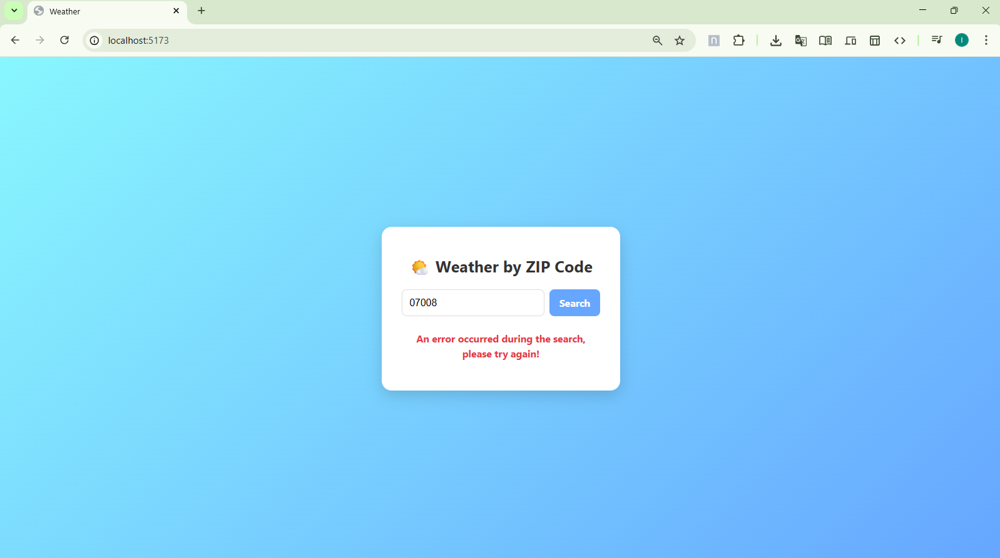
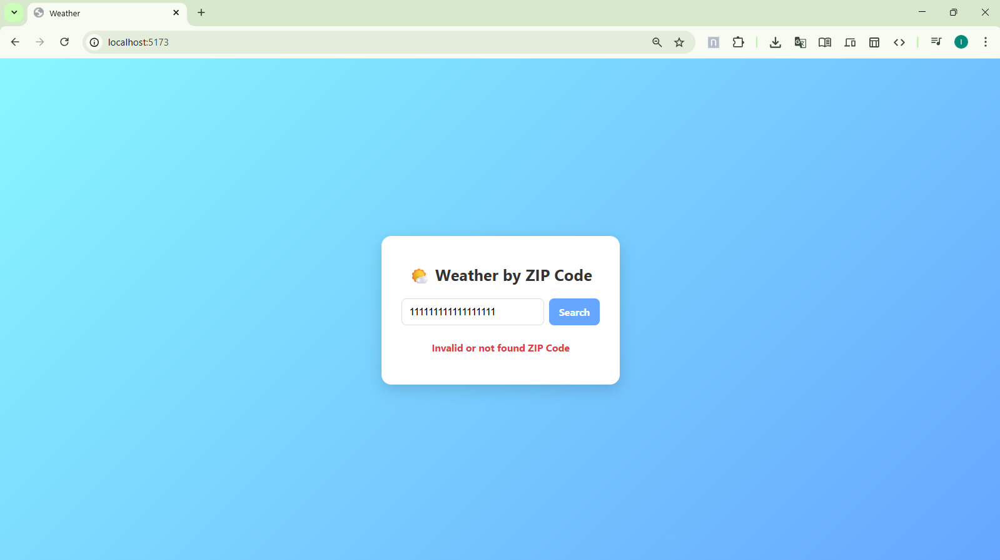
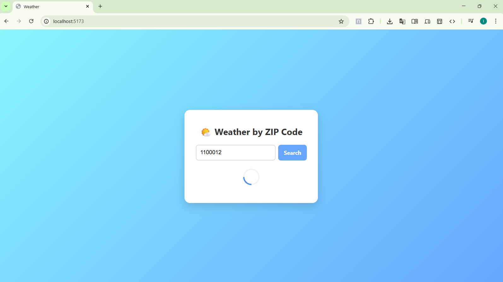
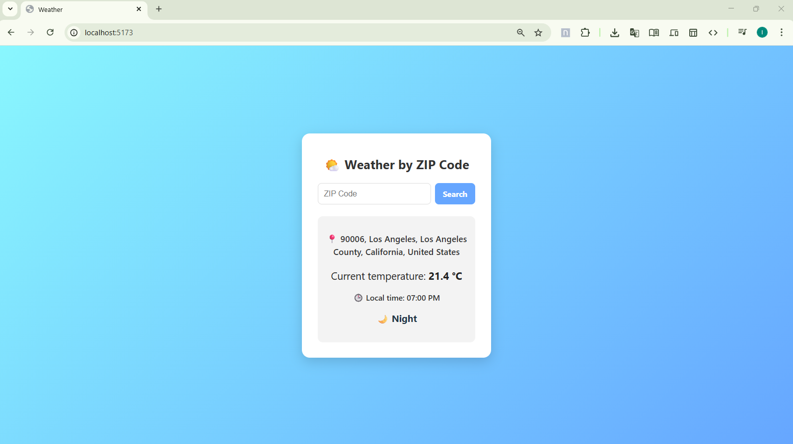
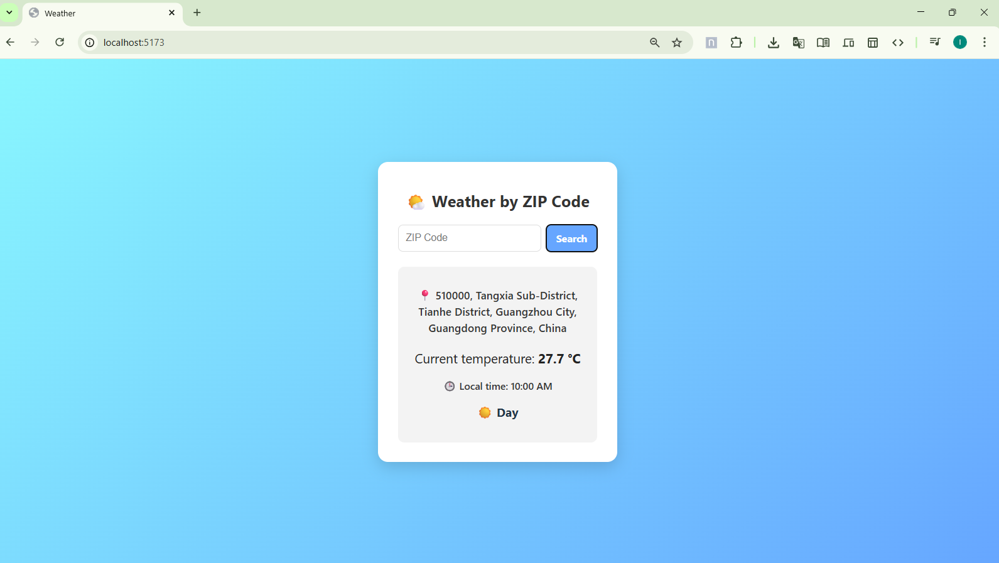
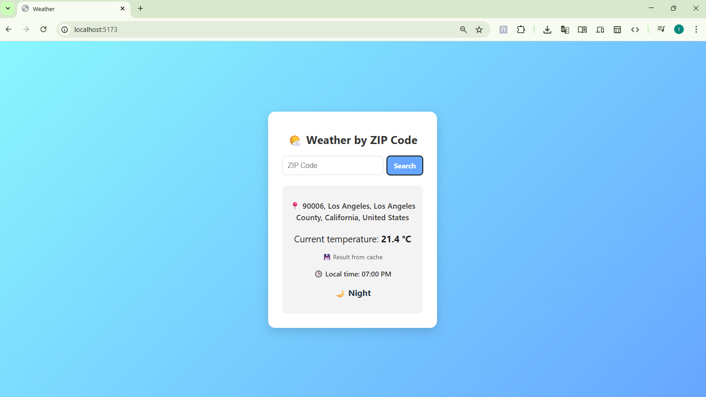

# Weather Forecast Rails/React App

## Overview

This project is a Ruby on Rails application with a React frontend that allows users to fetch weather forecasts based on an address or ZIP code. The app retrieves data from the Meteoblue API and caches results for 30 minutes using Rails' `memory_store`. Cached results include an indicator to show whether the data was retrieved from cache.

---

## Technology Stack

* **Backend:** Ruby on Rails 7+
* **Frontend:** React
* **Geocoding:** Geocoder gem for converting addresses to ZIP/coordinates
* **HTTP Requests:** HTTParty
* **Caching:** Rails MemoryStore
* **Testing:** RSpec

---

## Setup Instructions

### 1. Clone the repository

```bash
git clone https://github.com/YOURUSER/forecast-app.git
cd forecast-app
````

### 2. Backend Setup (Rails)

Install dependencies:

```bash
cd forecast-api
bundle install
```

Create a `.env` file in the project root and add your API key:

```env
METEOBLUE_API_KEY=your_api_key_here
```

> **Note:** Do not commit your `.env` file to version control. The key was sent by email to the interested party.

Setup the database:

```bash
rails db:create db:migrate
```

Start the Rails server:

```bash
rails server
```

### 3. Frontend Setup (React)

Install dependencies:

```bash
cd forecast-client
npm install
```

Start the React development server:

```bash
npm run dev
```

Open your browser at [http://localhost:5173](http://localhost:5173) to view the app.

---

## Running Tests

Run the backend tests with:

```bash
bundle exec rspec
```

---

## Screenshots / Demo

Example:








---
